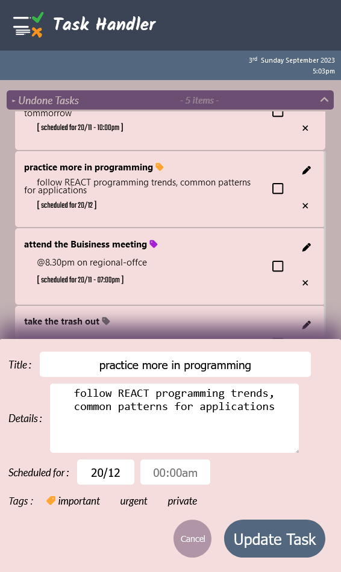

# Simple Task Handler

This project was bootstrapped with [Create React App](https://github.com/facebook/create-react-app).

## Excecute

### -> `npm install`

Install the dependancies first.

### -> `npm start`

Runs the app in the development mode.\
Open [http://localhost:3000](http://localhost:3000) to view it in your browser.

## Preview

This was the outcome of my project\
\

